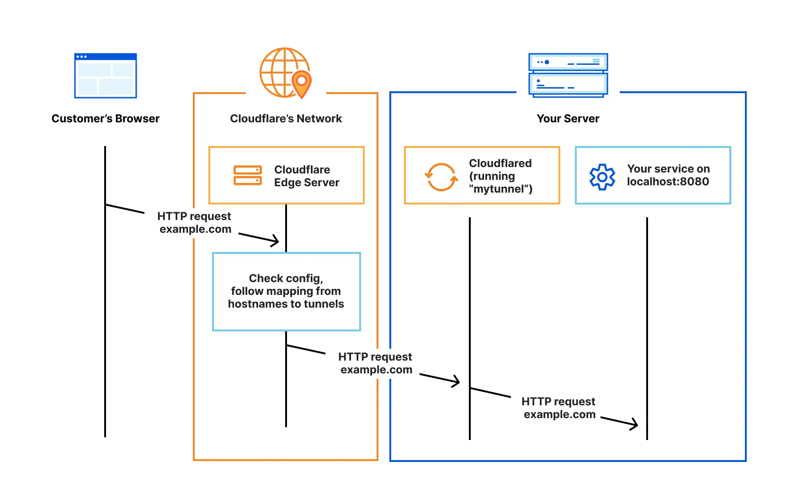

# Server Hosting Guide

Hosting a server with Mercury requries other devices on the internet (your viewers) to be able to discover your machine. With certain network configurations, this is no problem; your computer has a set, static (unchanging) IP address that you can share. Once given this IP, anybody can enter it into Mercury and send out a request to join. However, other network settings may not allow this.

## The Problem
It is common nowadays for a network to be configured with **private addresses**. Only the router in your home will have a "regular" IP address. All other devices on the network like computers or phones are instead given a private IP address. Then, when you want to browse the internet, your router performs what is called NAT translation to replace your private IP address with its public one in your outgoing internet packets. It notes what services you are trying to reach, and when those send data back to you, knows to forward that data back to your computer. Wikipedia explains this as the following (read more [here](https://en.wikipedia.org/wiki/Private_network)):

> Most Internet service providers (ISPs) allocate only a single publicly routable IPv4 address to each residential customer, but many homes have more than one computer, smartphone, or other Internet-connected device. In this situation, a network address translator (NAT/PAT) gateway is usually used to provide Internet connectivity to multiple hosts. 

This poses an issue:
* if your viewer is given your **private address**, they won't know how to reach your computer - only your router knows what that private address points to, and the viewer won't know how to find the router
* if your viwer is given your **public address**, they won't know how to reach your computer - they will find the router, but not be able to specify to the router which of its connected computers they want

Thankfully, this issue has multiple solutions.

### Static IP
By far the simplest solution is to purchase a **static IP**. These are public addresses an ISP will lease out to you for a set price. Once you have purchased one of these, you can configure it to your computer, and any other device on the internet who specifies that IP will be able to connect to you. 

| ISP    | Price (/month) |
| -------- | ------- |
| AT&T  | $15 to $40    |
| Version Business | $99.95     |
| Nordlayer    | $50    |
| Spectrum    | $15    |

### Port Forwarding
Another easy, and this time free, option is **port forwarding**. Choose a port that you will stream all Mercury session out of. Now, go to your router configuration settings, and port forward it to direct all traffic aimed at your public IP and that port to your computer. Any device supplied with your router's public IP and your chosen port will send traffic directly to your computer, allowing you to stream to them.

A guide to port forwarding: https://www.noip.com/support/knowledgebase/general-port-forwarding-guide

### Using a VPS
A VPS (Virtual Private Server) can be rented from online providers, and often can have a static IP (for an extra fee). This is cheaper than purchasing one for your own device because you don't have to lease one for an extended period of time from the ISP - only discuss renting the server from whatever company owns it. As a result, if you own a VPS with a static IP, you can remote into it using something like VNC and run Mercury from it.

Some options:
* https://aws.amazon.com/free/compute/lightsail/
* https://azure.microsoft.com/en-us/
* https://cloudzy.com/dedicated-ip-vps/
* https://go.lightnode.com/dedicated-ip-vps
* https://www.vps-mart.com/ip

### Cloud Tunneling
Cloud tunneling refers to a wide array of techniques for transporting data across a network using protocols not normally supported. Generally, it refers to encapsulating packets within additional headers (such as IP-in-IP). However, a specific kind of tunnel has become more popular recently. By trusting an external provider (such as Cloudflare) with your network traffic, you can have your users send data to a Cloudflare server, and have that server forward it on to your network. The way this avoids the issue with the NAT translation that normally occurs is that your computer can repeatedly send small packets of data to the Cloudflare server, and thus inform your router that any data coming from that server should be sent to it.

The downside to this is that you will be exposing all network traffic, you may have to pay a fee as usage scales, and configuring it for uncommon kinds of data (anything besides SSH or HTTP) can be difficult. You can read more about this option [here](https://developers.cloudflare.com/cloudflare-one/connections/connect-networks/).

