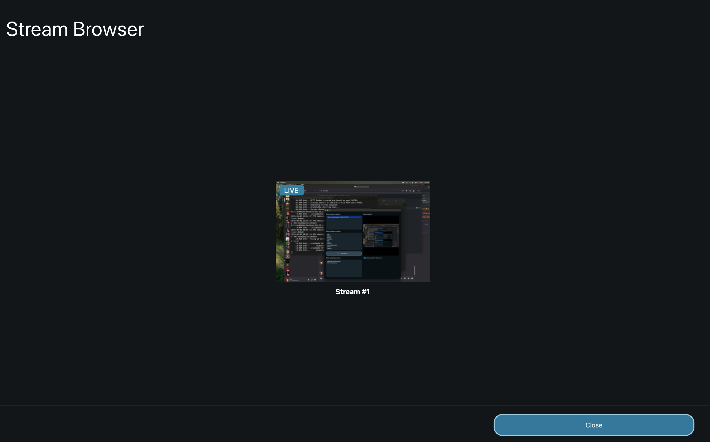

# Browsing Streams

This page is on exploring public streams. If you have an IP address and TCP port to join with, check out how to [join a stream](joining-streams).

The stream browser shows all publicly available streams. Clicking on one will allow you to join the stream.

Next: [In-Stream Features](features/chat)
