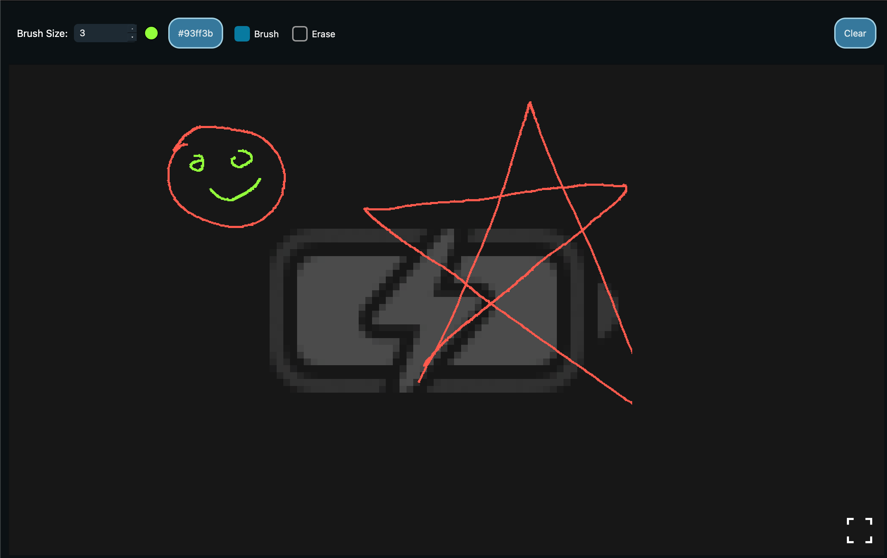

# Annotations

Annotations are drawings that can be made directly on the stream and will be shared with all viewers and the host. 

The tool bar across the top of the stream allows the user to customize the color and brush size of annotations. The host has an additional button that allows them to clear all annotations.

To disable annotations for specific users, the host can uncheck annotation privileges for the users under the [Viewer List](viewer-list) tab on the side pane.

Next: [Viewer List](viewer-list)
