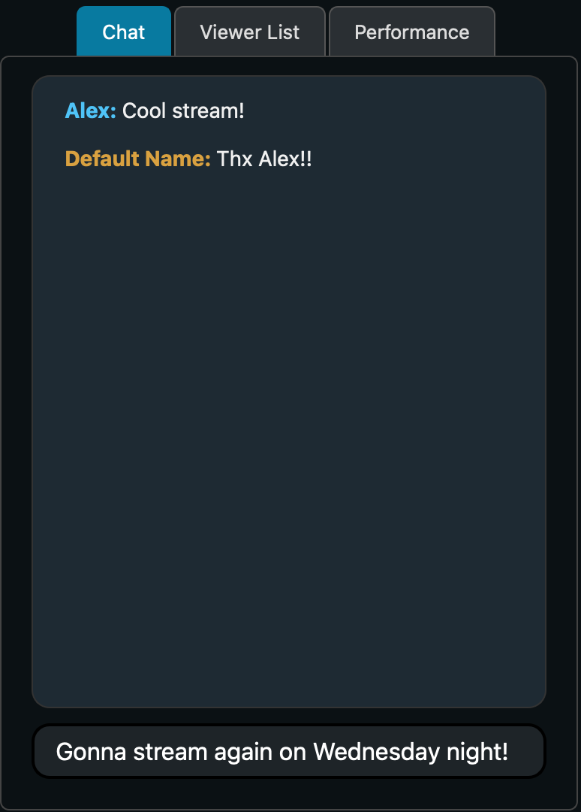

# Chat

The chat is a place for viewers to communicate with other viewers and the host. Your name shows up in yellow, while others' names show up in blue.

To see the chat, make sure that the side panel on the right is set to "Chat" and not "[Viewer List](viewer-list)" (only applies for the host), or "performance".

To type in the chat, simply click on the text field at the bottom, type your message and hit enter. All viewers and the host will receive the chat message.

Next: [Reactions](reactions)