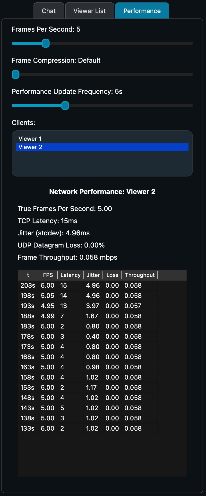
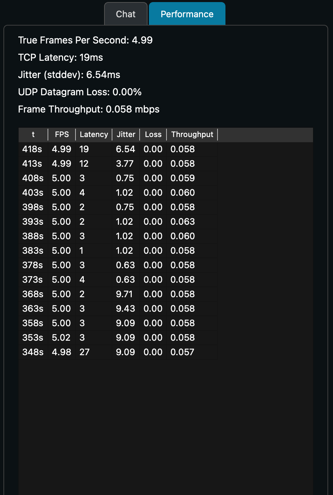

# Performance

The performance tab is located on the side pane of the stream. The stream host and viewers see different interfaces for the performance.

The host is able to set the fps (frames per second), frame compression, and performance update frequency of the stream. Additionally, it can see network performance details of each viewer.

The fps refers the frames per second that are captured and sent to viewers.
The frame compression refers to the amount that frames are compressed before being sent to viewers.
The performance update frequency refers to how often performance metrics on the performance tab are updated.

All viewers are able to see their own network performance which includes a few current values along with a time table showing the metrics at intervals set by performance update frequency (see above).

Next: [Settings](../settings)