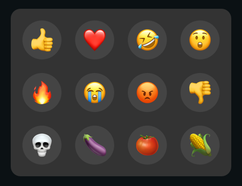
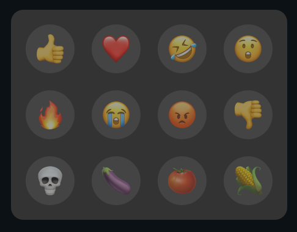
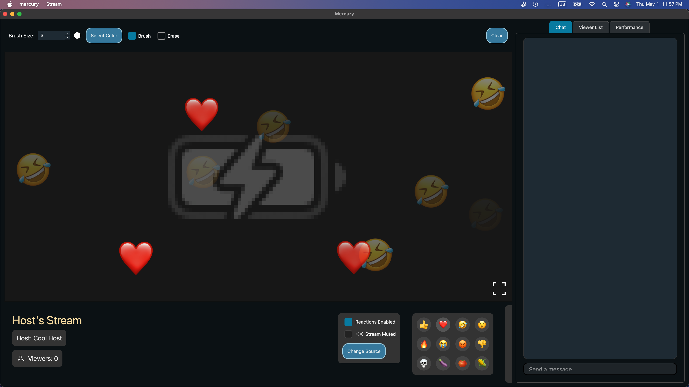

# Reactions

Reactions can be sent using the reaction panel located at the bottom of the stream. Both the host and viewers can send reactions given that the host has them enabled. To see how to enable or disable reactions, check out [hosting streams](../hosting-streams) and the [stream control panel](stream-control-panel).

Reactions enabled:

Reactions disabled:

Upon pressing a reaction, the corresponding reaction emoji appears on the stream for all viewers and the host.

Next: [Annotations](annotations)

