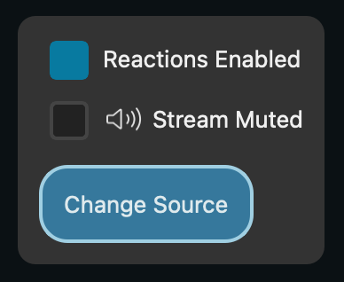

# Stream Control Panel

The Stream Control Panel is a panel below the stream which only the host has access to.

Currently a few simple controls are present here:

**Reaction Enable/Disable**

The host can toggle [reactions](reactions) for all viewers in the stream. 

**Mute Stream**

The mute stream checkbox allows the host to mute the audio of the stream.

**Change Streaming Source**

The change streaming source button opens the window that allows the host to change the source that is being streamed similar to source selection in the [host stream window](../hosting-streams).

Next: [Performance](performance)