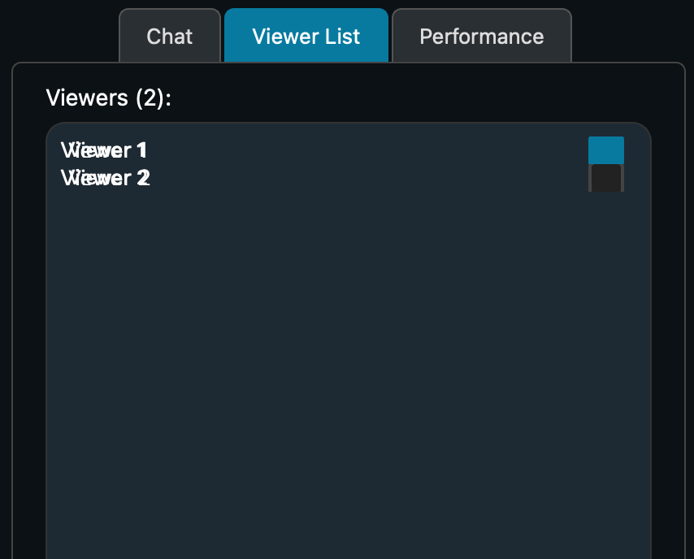

# Viewer List

The viewer list is a tab that only the host has access to on the side pane of the stream.

A simple list of all viewers (not including the host) are shown in a list. Additionally, [annotations](annotations) for select users can be enabled/disabled by toggling the checkbox next to their name.

The viewer list accurately reflects all users currently in the stream.

Next: [Performance](performance)