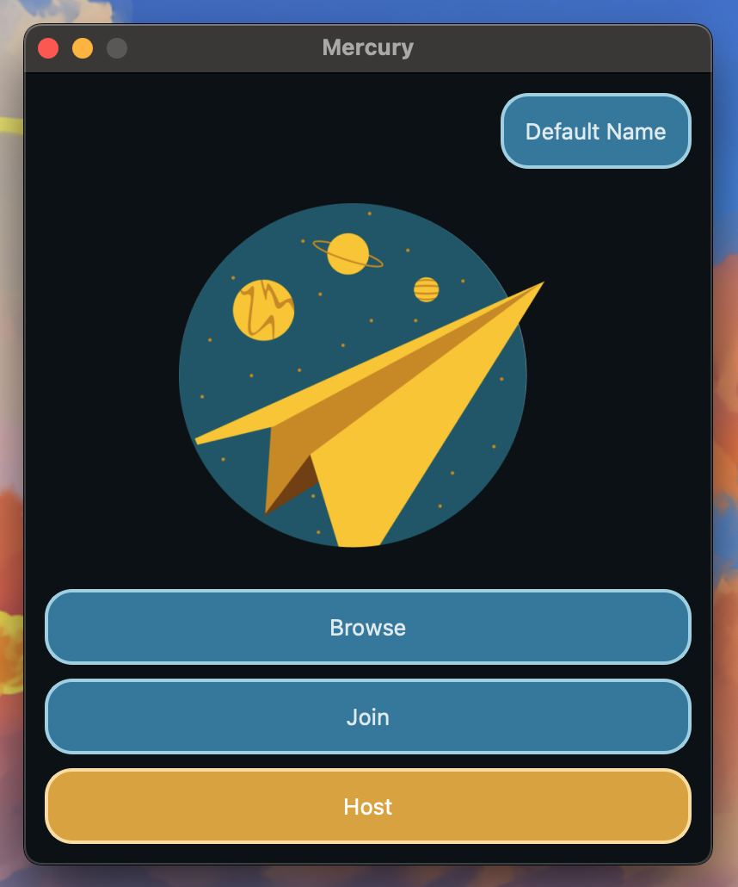

# Overview

Mercury is FOSS designed to allow for decentralized, peer to peer streaming and chatting between small groups. Built in C++ using Qt and a custom networking library for real-time video and audio, it prioritizes speed, efficiency, and ease of use.

**Contributors**
- Alex Hunton
- Christopher Lee
- Kris Leungwattanakij
- Leonard Pan
- Kai Tinkess

Mercury allows basic streaming functionalities such as [hosting](../hosting-streams), [joining](../joining-streams), and [browsing](../browsing-streams) streams.

In-Stream Features include: [chat](../features/chat), [reactions](../features/reactions), [annotations](../features/annotations), and [performance metrics](../features/performance)

Next: [Installation](installation)
