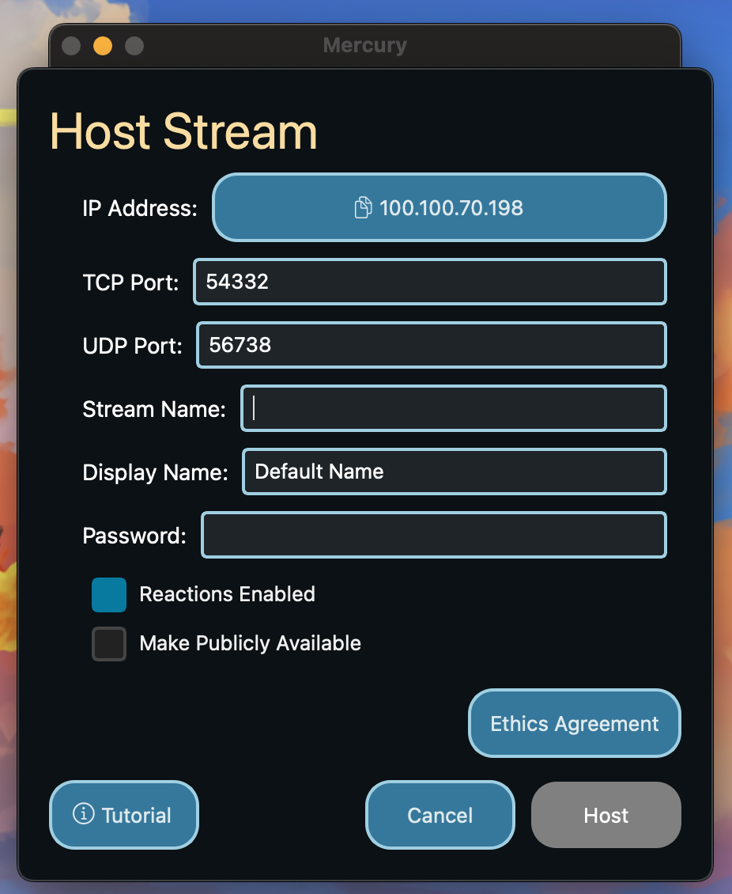
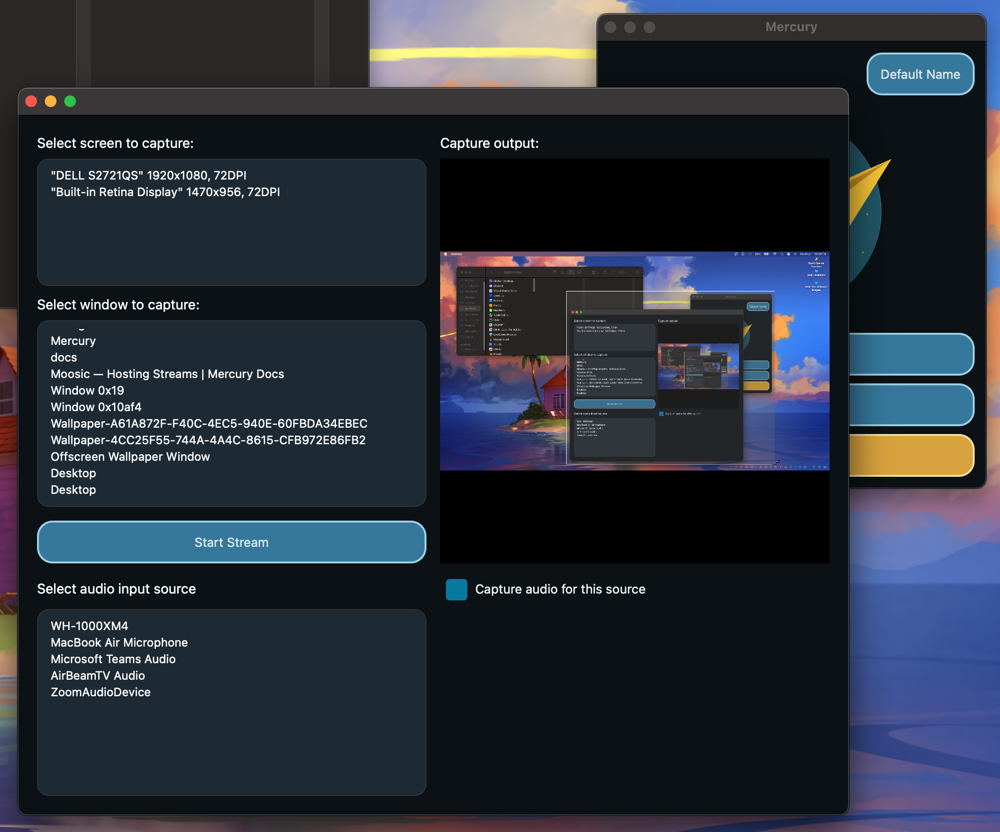
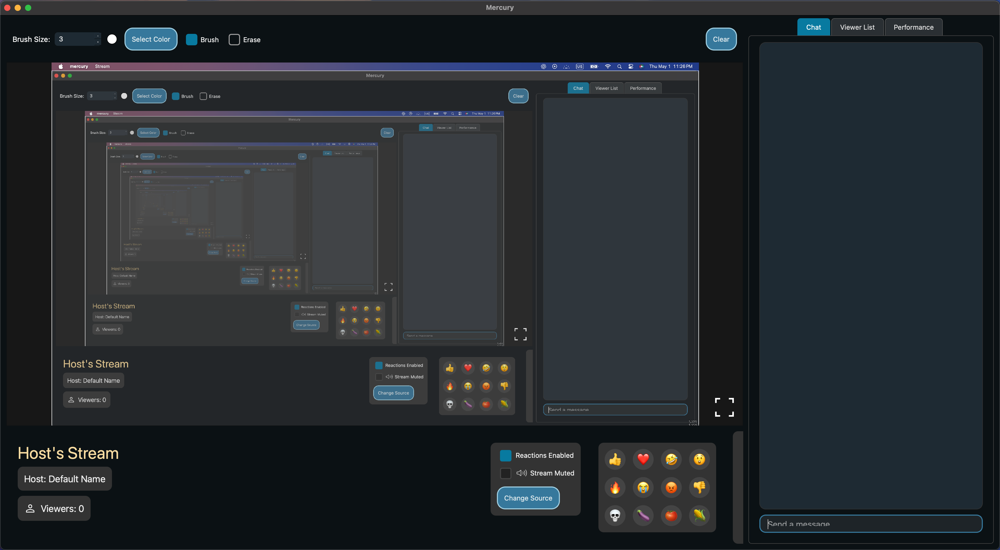

# Hosting a Stream

A button to copy your IP Address is provided at the top of the host stream window. You can then manually select the UDP port (for audio and video stream) and the TCP port (for all other communication). You will need to share the IP address and the appropriate TCP port with your users so they can connect to your stream.

A name for the stream (Stream Name) can be set as well as the alias for the host (Display Name) which will default to the one set in [Settings](../settings). Not setting either of these will result in a default value to be used.

Next, a password can optionally be provided. To not use a password, simply keep the password field empty.

An option to set enable/disable stream [reactions](/features/reactions) before starting the stream is here for convenience . This can be changed during the stream.

You can make your stream available to the public via the [Stream Browser](/browsing-streams) by checking the "Make Publicly Available" checkbox. This allows for all clients to easily access your stream. On the contrary, unchecking the "Make Publicly Available" check box will ensure that viewers use your ip address and select the appropriate UDP port to connect to your stream.

Before moving on, you must agree to the Ethics Agreement which covers the ethical responsiblity you take on by hosting a stream using Mercury.

After pressing the "Host" button, you will be prompted to select the streaming source. This can either be a window or the entire screen. The audio source can also be optionally captured and manually selected. The video and audio stream can be changed during the stream (See [stream control panel](/features/stream-control-panel)).

Upon selecting the appropriate options, pressing "Start Stream" will begin the stream, entering you into the streaming window and allowing viewers to join.

Next: [Joining Streams](joining-streams)