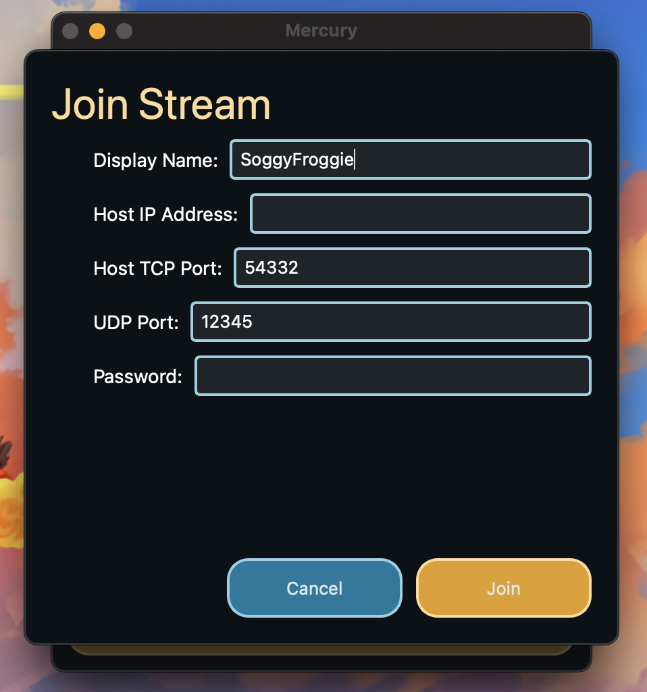
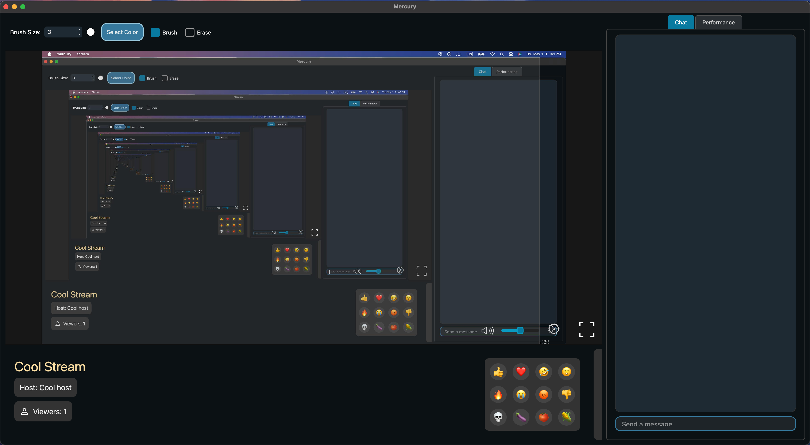

# Joining a Stream

This page is on manually joining a stream via IP address. To learn how to explore public streams see how to use the [Stream Browser](browsing-streams).

To manually join a stream, provide the host IP address along with the host TCP port which your host should provide you with. Additionally, provide an available port on your machine for UDP. 

Additionally, you can select a Display Name to use in stream which will show up in the [stream chat](features/chat) and [viewer list](features/viewer-list). The default name that is used can be changed in [Settings](settings).

Finally, if your stream host has set a password, enter it here. If there is no stream password, simply leave the password field blank.

Upon pressing join, if the all entered information is accurate, you will be joined to the host's stream.

Next: [Browsing Streams](browsing-streams)