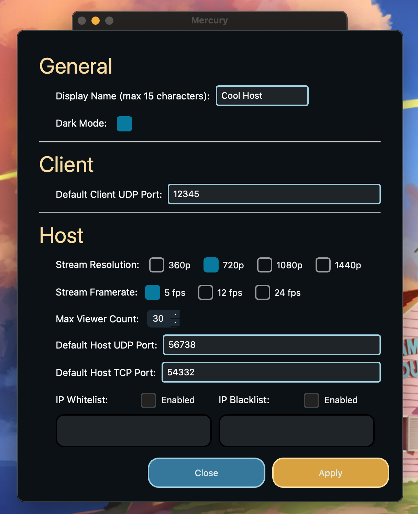
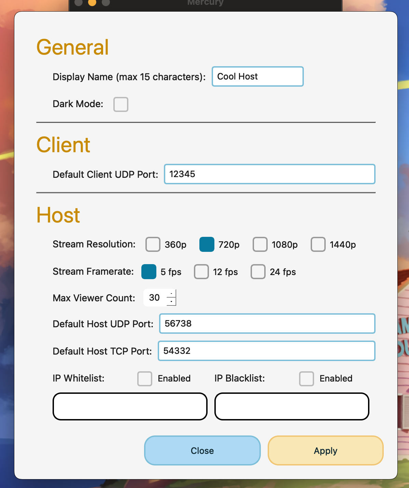
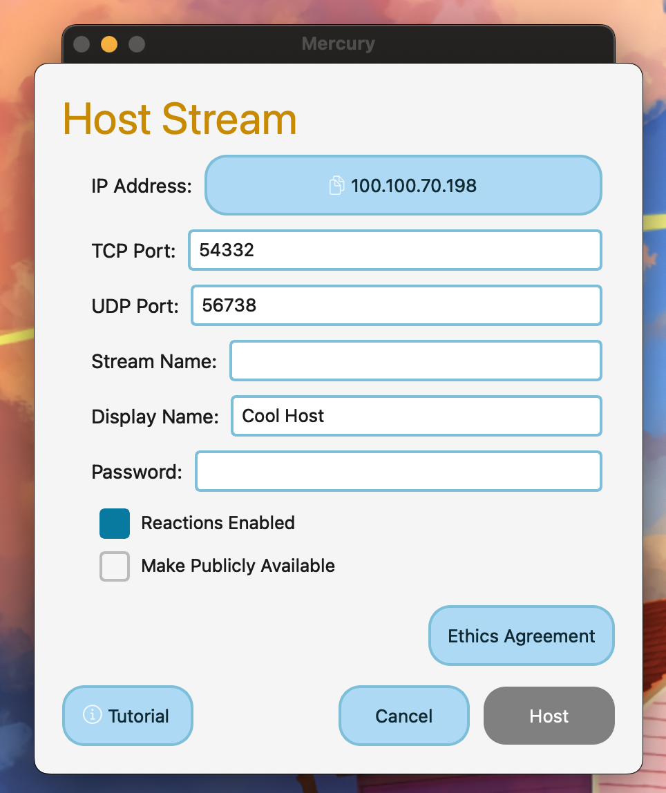

# Settings

Pressing on the display name in the home window brings the user to this window.

The settings menu allows the user to customize default values used for their display name, default udp port, resolution, white/blacklists, and more.

Additionally, dark mode can be enabled or disabled here. Here is an example of what the light theme looks like:

